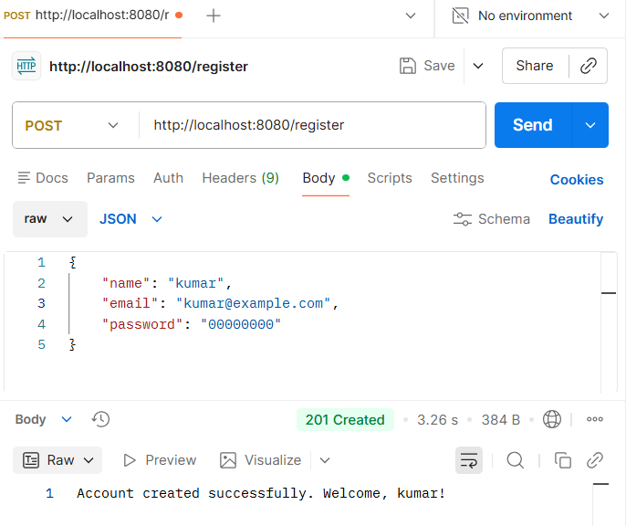
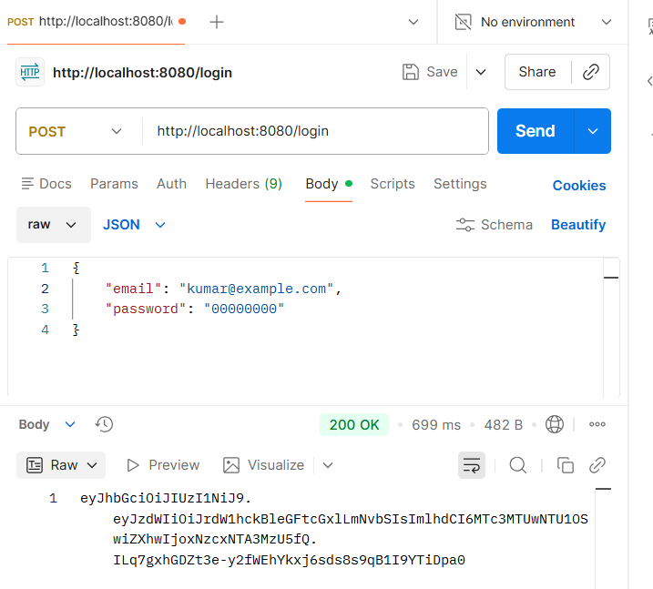
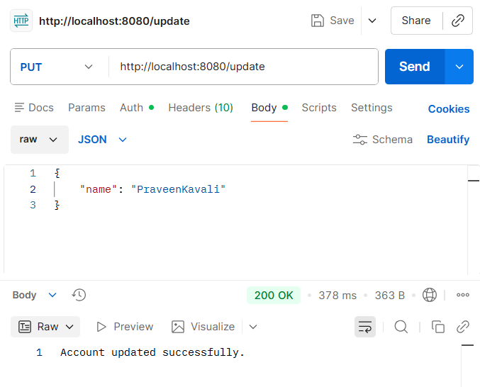
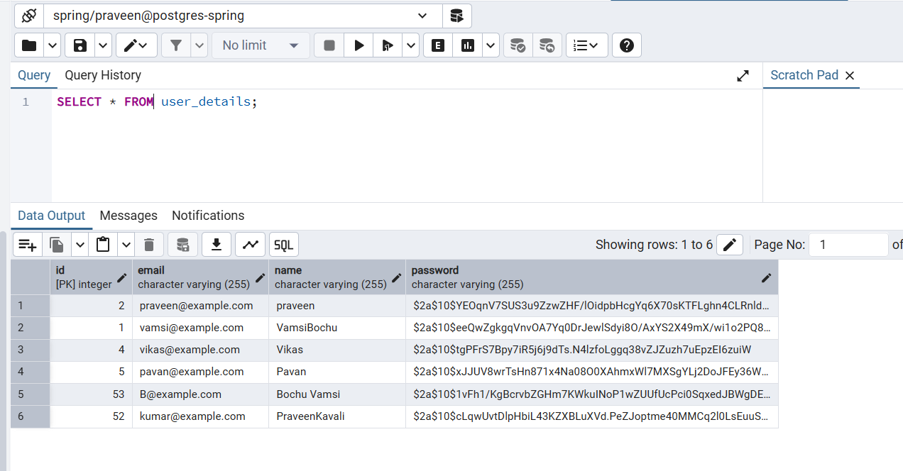
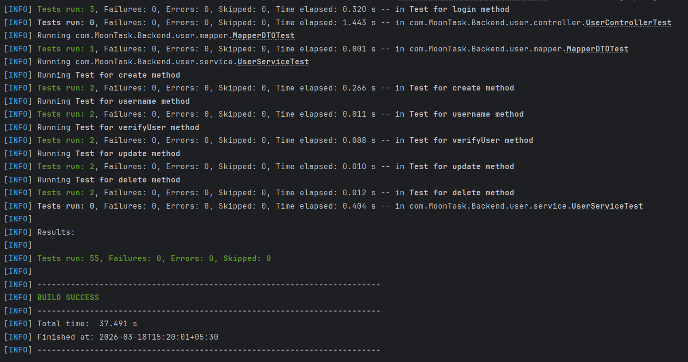
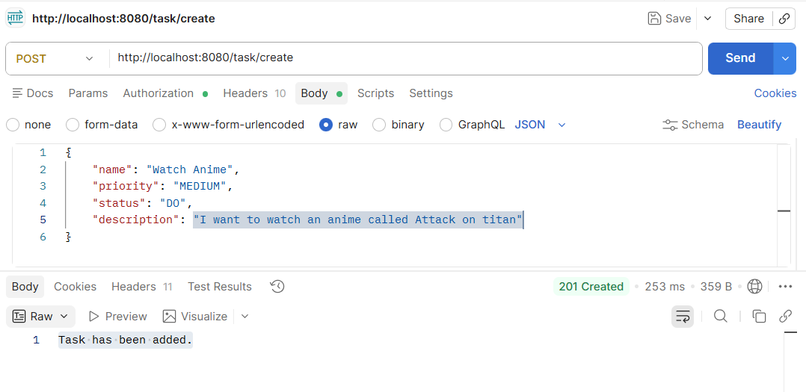
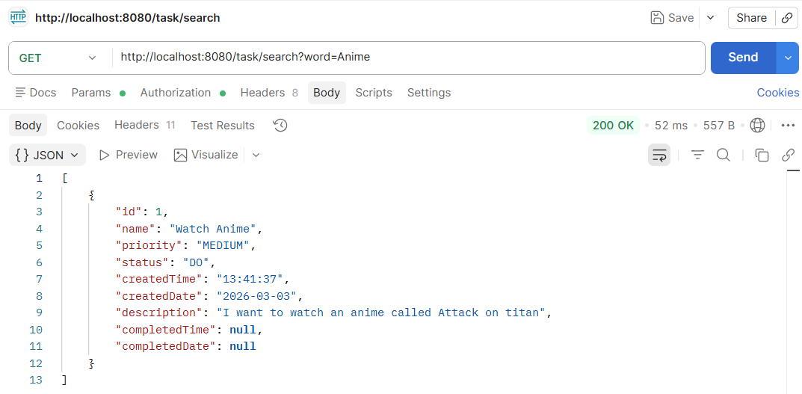
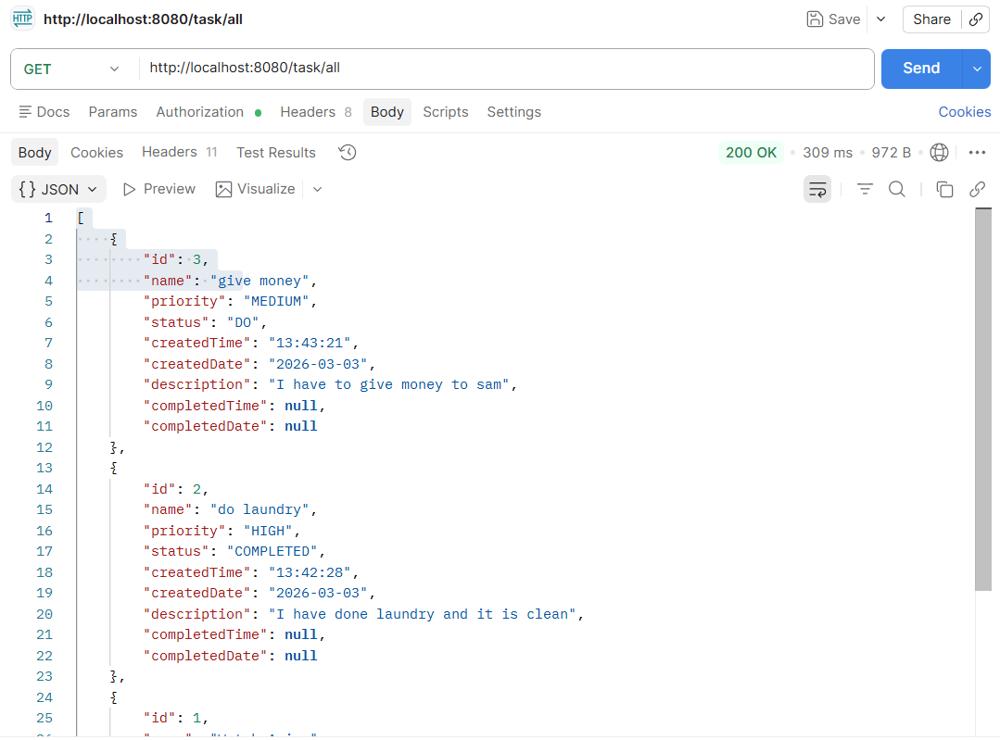
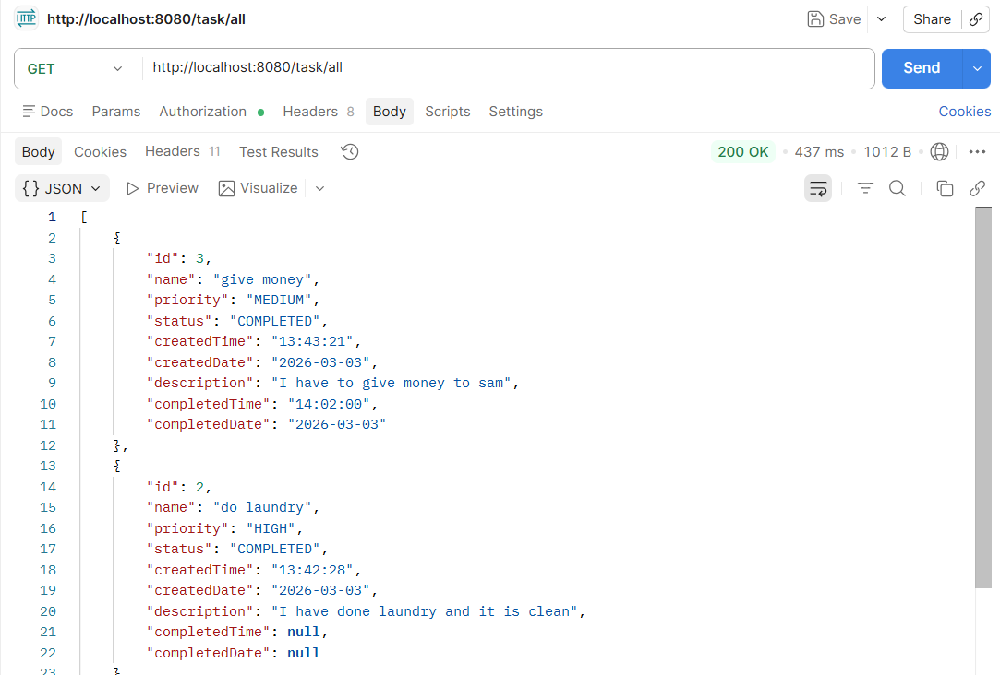
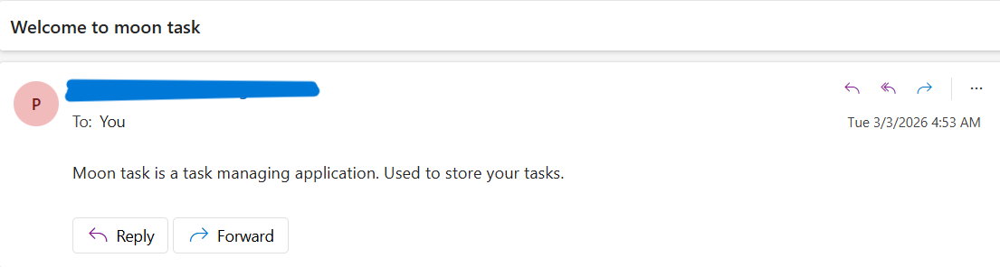

# Moon Task

**Task Service Project:** A full stack application for task management.

## 🚀 Tech Stack
- Backend: Spring Boot, JPA/Hibernate, REST APIs
- Database: MySQL/PostgreSQL
- Frontend: React

## ✅ Completed Features
- User login with name, email, and password
- Secure credential storage with hashed passwords
- Authentication and error handling for login failures
- Global exception handling for unexpected errors
- Design related to task management in spring boot.
- Filtering tasks by status, priority, etc.
- JUnit and Mockito for testing in backend.
- Used redis for caching purpose.
- Create a docker image out of the backend code.

## 📸 Screenshots

    

        Click here to see more screenshorts
    

### Full Test Suite Execution

### Task Creation

### Searching for a task

### All Tasks View

### All Tasks View After Executing some Endpoints

### email sending after creating a user

